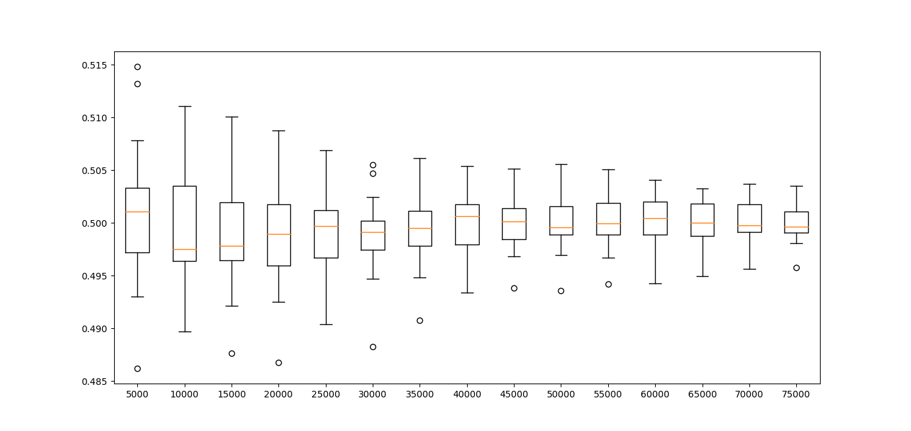
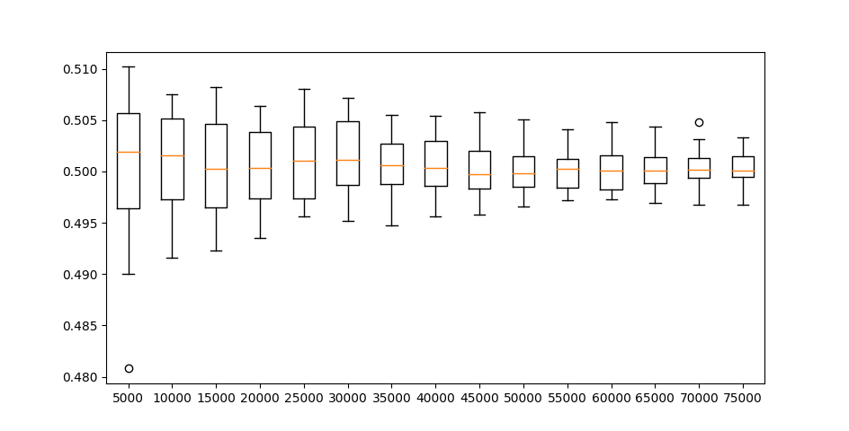
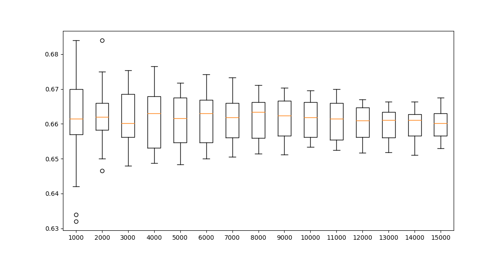
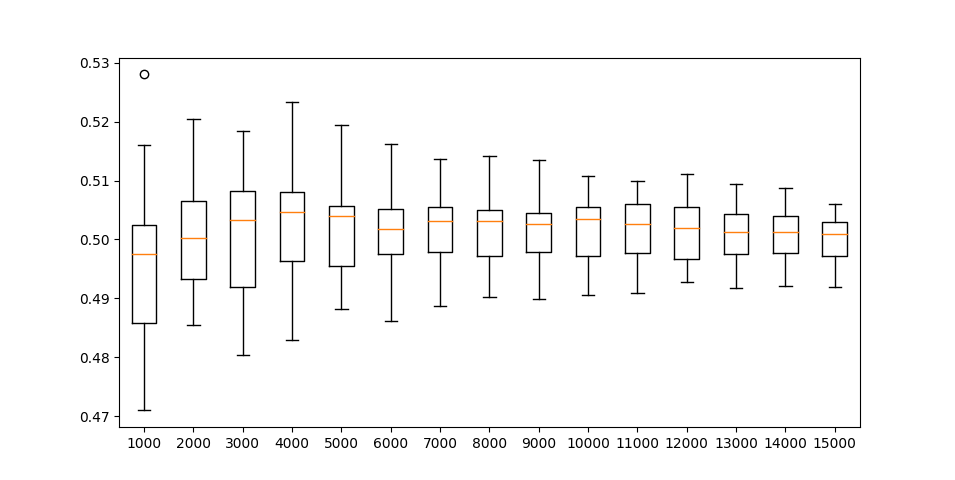
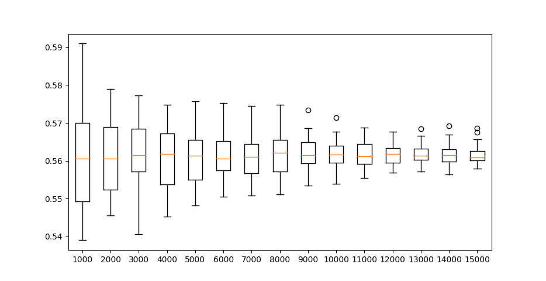
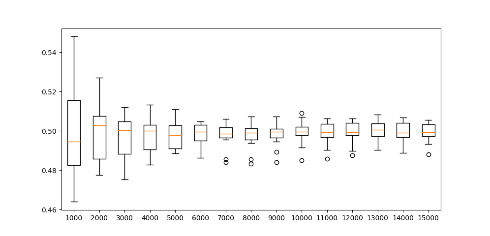

### Wpływ ilości danych na dokładność wyniku

Eksperyment polegający na zbadaniu jaki wpływ ma ilość wykonanych prób na dokładność otrzymanych wyników.
W grze w Wojnę, gdy mamy dwóch graczy i gracze zbierają karty losowo, ilość wygranych każdego z graczy powinna być równa około 50%.
Dlatego właśnie przeprowadziliśmy eksperyment w którym gracze otrzymują karty losowo i każdy z graczy po wygranej wkłada karty do swojej talii w losowej kolejności. Próby były powtarzane 20 razy.
Na osi pionowej widzimy jaką część wszystkich gier wygrał gracz numer 1, a na osi poziomej liczbę rozegranych gier.

Możemy zauważyć, że wyraźne zmniejszenie rozstrzału wyników przestajemy obserwować powyżej 50 tysięcy gier.

W przypadku, gdy talie są od początku zbalansowane (każdy z graczy otrzymuje po 2 karty każdej z figur) otrzymujemy następujący wykres:

W tym przypadku wyniki są bardziej wyrównane i skupione bliżej poziomu 50% wygranych.

### Strategia - moja karta na górze

#### Przeciwko przeciwnikowi stosującemu strategię losową

Zbadaliśmy jaki skutek przynosi stosowanie strategii wkładania do talii swojej karty ponad kartą przeciwnika.
Do tego eksperymentu gracze otrzymywali idealnie zbalansowane talie (każda z figur występowała po 2 razy u każdego z graczy).

Dla 50 000 gier i 20 prób, liczba wygranych partii wynosiła średnio 66.0272%

#### Przeciwko przeciwnikowi stosującemu taką samą strategię

Dla 50 000 gier i 20 prób, liczba wygranych partii wynosiła średnio 49.99840000000001%.
Jest to wynik zgodny z oczekiwaniami - oznacza, że strategia obu graczy w takim samym stopniu przybliża do wygranej.

### Strategia - moja karta na dole

#### Przeciwko przeciwnikowi stosującemu strategię losową

Zbadaliśmy jaki skutek przynosi stosowanie strategii wkładania do talii swojej karty na spód.
Do tego eksperymentu gracze otrzymywali idealnie zbalansowane talie (każda z figur występowała po 2 razy u każdego z graczy).

Dla 50 000 gier i 20 prób, liczba wygranych partii wynosiła średnio 56.155%

#### Przeciwko przeciwnikowi stosującemu taką samą strategię

Dla 50 000 gier i 20 prób, liczba wygranych partii wynosiła średnio 50.0011%.

### Strategia - moja karta na dole przeciwko moja karta na górze

Przy zastosowaniu takich strategii wiele gier trafia na nieskończoną pętlę i nigdy się nie kończy.
Z tego powodu ustawiliśmy maksymalną liczbę rund na 15 000.
Dla 20 000 różnych gier tylko 3425 (17.125%) udało się skończyć, a nieroztrzygniętych zostało 16575.
Gracz stosujący strategię moja na spód wygrał 50.04379562043796% z tych 3425 gier.
